# Diagramas de secuencia de BookyHome

Estos diagramas representan los flujos principales implementados en la aplicación web de BookyHome. Los participantes se mantienen a nivel de arquitectura: interfaz React, cliente Axios, routers FastAPI, modelos, archivos JSON y MySQL.

Las rutas y comportamientos fueron contrastados con `frontend/src`, `backend/app/routers`, `backend/app/models`, `app/auth.py` y `database/bookyhome.sql`.

## Alcance y trazabilidad

El alcance anterior cubría siete procesos principales. Esta versión amplía la revisión a todos los módulos documentados y implementados en el proyecto. Los números HU/RF corresponden a `docs/requisitos/HIS/` y `docs/requisitos/RF/`.

| Área | HU relacionadas | RF relacionadas | Diagrama |
|---|---|---|---|
| Registro, autenticación y sesión | HU-001, HU-037, HU-038, HU-039 | RF-001, RF-002, RF-003, RF-004 | Secciones 1 y 2 |
| Publicación, catálogo y disponibilidad | HU-002, HU-003, HU-004, HU-010, HU-011, HU-012, HU-016, HU-019, HU-040 | RF-005 a RF-010, RF-018, RF-037 a RF-039 | Secciones 3 y 6 |
| Carrito, pedidos y pagos | HU-034, HU-021, HU-022, HU-041, HU-042 | RF-023 a RF-025, RF-034 | Sección 4 |
| Perfil, compras e historial | HU-014, HU-018, HU-041 | RF-015, RF-017, RF-023, RF-041 | Sección 5 |
| Promociones y herramientas | HU-020, HU-028 | RF-028, RF-040 | Secciones 7 y 12 |
| Chat, notificaciones y soporte | HU-005, HU-013, HU-023, HU-036 | RF-011, RF-012, RF-019, RF-020, RF-036 | Secciones 8 y 10 |
| Favoritos, reseñas y comunidad | HU-006, HU-007, HU-017, HU-031 | RF-013, RF-014, RF-016, RF-031 | Sección 9 |
| Administración y usuarios | HU-025, HU-024 | RF-021, RF-022, RF-036 | Sección 11 |
| Envios, devoluciones y finanzas | HU-032, HU-028 | RF-024, RF-032, RF-039 | Secciones 4, 10 y 12 |
| Recomendaciones y difusión | HU-009, HU-026, HU-027 | RF-026, RF-027 | Sección 13 |
| Sincronización multidispositivo | HU-029, HU-030 | RF-029, RF-030 | Secciones 4, 5 y 13 |

### Convenciones

- `actor` representa al usuario humano.
- `UI` representa componentes React y navegación del frontend web.
- `Axios` representa el cliente compartido que adjunta `Authorization: Bearer <token>`.
- `Router` representa los módulos FastAPI.
- `Modelo` representa la lógica de `backend/app/models/`.
- `DB` representa MySQL.
- `JSON` representa los almacenes locales `cart_store.json` y `orders.json`.
- Las rutas con `*` siguen el prefijo registrado en `backend/app/main.py`.

## 1. Registro, verificación de correo e inicio de sesión

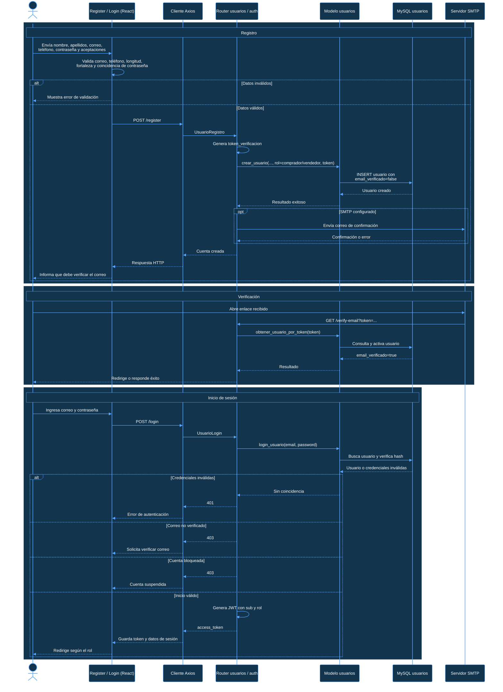
```mermaid
%%{init: {"theme":"base","themeVariables":{"background":"#0B1020","primaryColor":"#12344D","primaryTextColor":"#FFFFFF","primaryBorderColor":"#58A6FF","lineColor":"#58A6FF","textColor":"#FFFFFF","actorBkg":"#12344D","actorBorder":"#58A6FF","actorTextColor":"#FFFFFF","actorLineColor":"#58A6FF","signalColor":"#58A6FF","signalTextColor":"#FFFFFF","labelBoxBkgColor":"#12344D","labelBoxBorderColor":"#58A6FF","labelTextColor":"#FFFFFF","loopTextColor":"#FFFFFF","noteBkgColor":"#12344D","noteBorderColor":"#58A6FF","noteTextColor":"#FFFFFF","activationBkgColor":"#12344D","activationBorderColor":"#58A6FF","sequenceNumberColor":"#FFFFFF"}}}%%
sequenceDiagram
    actor Usuario
    participant UI as Register / Login (React)
    participant Axios as Cliente Axios
    participant Auth as Router usuarios / auth
    participant Usuarios as Modelo usuarios
    participant DB as MySQL usuarios
    participant SMTP as Servidor SMTP

    rect rgb(18, 52, 77)
    Note over Usuario,SMTP: Registro
    Usuario->>UI: Envía nombre, apellidos, correo,<br/>teléfono, contraseña y aceptaciones
    UI->>UI: Valida correo, teléfono, longitud,<br/>fortaleza y coincidencia de contraseña
    alt Datos inválidos
        UI-->>Usuario: Muestra error de validación
    else Datos válidos
        UI->>Axios: POST /register
        Axios->>Auth: UsuarioRegistro
        Auth->>Auth: Genera token_verificacion
        Auth->>Usuarios: crear_usuario(..., rol=comprador/vendedor, token)
        Usuarios->>DB: INSERT usuario con<br/>email_verificado=false
        DB-->>Usuarios: Usuario creado
        Usuarios-->>Auth: Resultado exitoso
        opt SMTP configurado
            Auth->>SMTP: Envía correo de confirmación
            SMTP-->>Auth: Confirmación o error
        end
        Auth-->>Axios: Cuenta creada
        Axios-->>UI: Respuesta HTTP
        UI-->>Usuario: Informa que debe verificar el correo
    end
    end

    rect rgb(18, 52, 77)
    Note over Usuario,SMTP: Verificación
    Usuario->>SMTP: Abre enlace recibido
    SMTP->>Auth: GET /verify-email?token=...
    Auth->>Usuarios: obtener_usuario_por_token(token)
    Usuarios->>DB: Consulta y activa usuario
    DB-->>Usuarios: email_verificado=true
    Usuarios-->>Auth: Resultado
    Auth-->>Usuario: Redirige o responde éxito
    end

    rect rgb(18, 52, 77)
    Note over Usuario,DB: Inicio de sesión
    Usuario->>UI: Ingresa correo y contraseña
    UI->>Axios: POST /login
    Axios->>Auth: UsuarioLogin
    Auth->>Usuarios: login_usuario(email, password)
    Usuarios->>DB: Busca usuario y verifica hash
    DB-->>Usuarios: Usuario o credenciales inválidas
    alt Credenciales inválidas
        Usuarios-->>Auth: Sin coincidencia
        Auth-->>Axios: 401
        Axios-->>UI: Error de autenticación
    else Correo no verificado
        Auth-->>Axios: 403
        Axios-->>UI: Solicita verificar correo
    else Cuenta bloqueada
        Auth-->>Axios: 403
        Axios-->>UI: Cuenta suspendida
    else Inicio válido
        Auth->>Auth: Genera JWT con sub y rol
        Auth-->>Axios: access_token
        Axios-->>UI: Guarda token y datos de sesión
        UI-->>Usuario: Redirige según el rol
    end
    end
```

## 2. Cierre de sesión

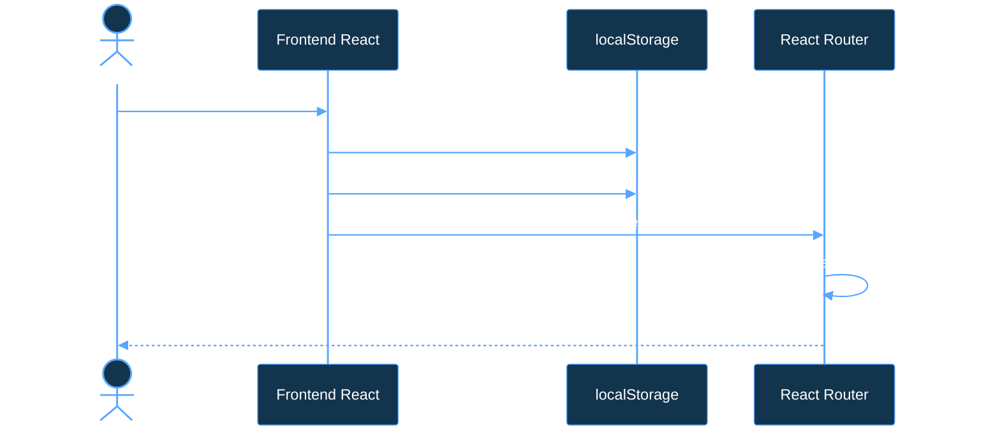
```mermaid
%%{init: {"theme":"base","themeVariables":{"background":"#0B1020","primaryColor":"#12344D","primaryTextColor":"#FFFFFF","primaryBorderColor":"#58A6FF","lineColor":"#58A6FF","textColor":"#FFFFFF","actorBkg":"#12344D","actorBorder":"#58A6FF","actorTextColor":"#FFFFFF","actorLineColor":"#58A6FF","signalColor":"#58A6FF","signalTextColor":"#FFFFFF","labelBoxBkgColor":"#12344D","labelBoxBorderColor":"#58A6FF","labelTextColor":"#FFFFFF","loopTextColor":"#FFFFFF","noteBkgColor":"#12344D","noteBorderColor":"#58A6FF","noteTextColor":"#FFFFFF","activationBkgColor":"#12344D","activationBorderColor":"#58A6FF","sequenceNumberColor":"#FFFFFF"}}}%%
sequenceDiagram
    actor Usuario
    participant UI as Frontend React
    participant Storage as localStorage
    participant Router as React Router

    Usuario->>UI: Selecciona cerrar sesión
    UI->>Storage: Elimina token y datos de sesión
    UI->>Storage: Conserva solamente preferencias locales
    UI->>Router: Emite auth-change
    Router->>Router: Descarta rutas privadas y limpia estado
    Router-->>Usuario: Redirige a la página pública
```

El cierre de sesión es principalmente local: el frontend elimina el JWT. El backend no implementa una lista de revocación ni un endpoint de logout; por eso, un token copiado fuera de la sesión puede seguir siendo válido hasta su expiración.

## 3. Recuperación de contraseña

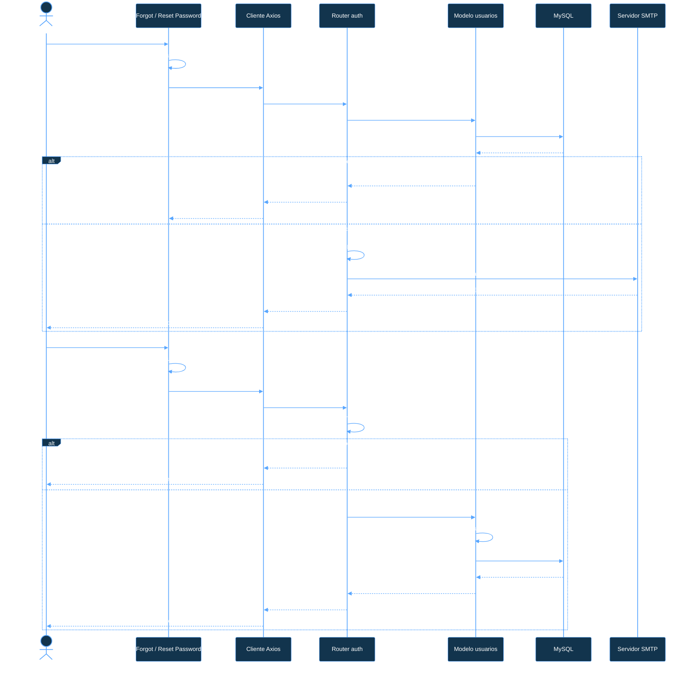
```mermaid
%%{init: {"theme":"base","themeVariables":{"background":"#0B1020","primaryColor":"#12344D","primaryTextColor":"#FFFFFF","primaryBorderColor":"#58A6FF","lineColor":"#58A6FF","textColor":"#FFFFFF","actorBkg":"#12344D","actorBorder":"#58A6FF","actorTextColor":"#FFFFFF","actorLineColor":"#58A6FF","signalColor":"#58A6FF","signalTextColor":"#FFFFFF","labelBoxBkgColor":"#12344D","labelBoxBorderColor":"#58A6FF","labelTextColor":"#FFFFFF","loopTextColor":"#FFFFFF","noteBkgColor":"#12344D","noteBorderColor":"#58A6FF","noteTextColor":"#FFFFFF","activationBkgColor":"#12344D","activationBorderColor":"#58A6FF","sequenceNumberColor":"#FFFFFF"}}}%%
sequenceDiagram
    actor Usuario
    participant UI as Forgot / Reset Password
    participant Axios as Cliente Axios
    participant Auth as Router auth
    participant Usuarios as Modelo usuarios
    participant DB as MySQL
    participant SMTP as Servidor SMTP

    Usuario->>UI: Solicita recuperación y escribe su correo
    UI->>UI: Valida formato del correo
    UI->>Axios: POST /forgot-password
    Axios->>Auth: ForgotPasswordRequest
    Auth->>Usuarios: obtener_usuario_por_email(email)
    Usuarios->>DB: Busca correo
    DB-->>Usuarios: Usuario o null
    alt Usuario no encontrado
        Usuarios-->>Auth: No existe
        Auth-->>Axios: correo_enviado=false
        Axios-->>UI: Informa que no existe cuenta
    else Usuario encontrado
        Auth->>Auth: Crea JWT temporal tipo reset
        Auth->>SMTP: Envía enlace con token
        SMTP-->>Auth: Envío realizado
        Auth-->>Axios: correo_enviado=true
        Axios-->>Usuario: Solicita revisar correo
    end

    Usuario->>UI: Abre enlace y escribe nueva contraseña
    UI->>UI: Valida longitud y fortaleza
    UI->>Axios: POST /reset-password
    Axios->>Auth: {token, password}
    Auth->>Auth: Verifica JWT y tipo=reset
    alt Token inválido o expirado
        Auth-->>Axios: 400
        Axios-->>Usuario: Solicita nuevo enlace
    else Token válido
        Auth->>Usuarios: actualizar_password(id_usuario, password)
        Usuarios->>Usuarios: Genera nuevo hash
        Usuarios->>DB: UPDATE contraseña
        DB-->>Usuarios: Actualización completada
        Usuarios-->>Auth: Resultado
        Auth-->>Axios: Contraseña actualizada
        Axios-->>Usuario: Redirige a inicio de sesión
    end
```

## 4. Exploración del catálogo y detalle de un libro

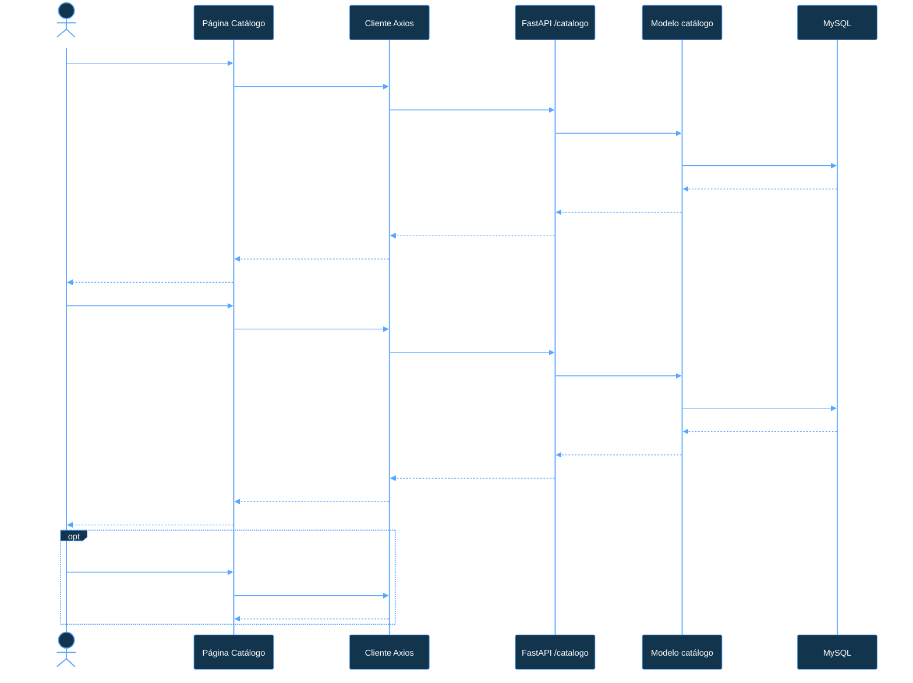
```mermaid
%%{init: {"theme":"base","themeVariables":{"background":"#0B1020","primaryColor":"#12344D","primaryTextColor":"#FFFFFF","primaryBorderColor":"#58A6FF","lineColor":"#58A6FF","textColor":"#FFFFFF","actorBkg":"#12344D","actorBorder":"#58A6FF","actorTextColor":"#FFFFFF","actorLineColor":"#58A6FF","signalColor":"#58A6FF","signalTextColor":"#FFFFFF","labelBoxBkgColor":"#12344D","labelBoxBorderColor":"#58A6FF","labelTextColor":"#FFFFFF","loopTextColor":"#FFFFFF","noteBkgColor":"#12344D","noteBorderColor":"#58A6FF","noteTextColor":"#FFFFFF","activationBkgColor":"#12344D","activationBorderColor":"#58A6FF","sequenceNumberColor":"#FFFFFF"}}}%%
sequenceDiagram
    actor Usuario
    participant Cat as Página Catálogo
    participant Axios as Cliente Axios
    participant API as FastAPI /catalogo
    participant Modelo as Modelo catálogo
    participant DB as MySQL

    Usuario->>Cat: Abre catálogo o cambia filtros
    Cat->>Axios: GET /catalogo/busqueda-avanzada
    Axios->>API: Parámetros de búsqueda y paginación
    API->>Modelo: Ejecuta consulta avanzada
    Modelo->>DB: Filtra categoría, precio, tienda,<br/>calificación, disponibilidad y texto
    DB-->>Modelo: Lista paginada
    Modelo-->>API: Libros, páginas y totales
    API-->>Axios: Respuesta HTTP
    Axios-->>Cat: Actualiza tarjetas y paginación
    Cat-->>Usuario: Muestra resultados

    Usuario->>Cat: Selecciona un libro
    Cat->>Axios: GET /catalogo/libro/{id_libro}
    Axios->>API: Id del libro
    API->>Modelo: Obtiene detalle
    Modelo->>DB: Libro, tienda, imágenes,<br/>variantes y disponibilidad
    DB-->>Modelo: Datos relacionados
    Modelo-->>API: Detalle del libro
    API-->>Axios: Respuesta HTTP
    Axios-->>Cat: Dibuja detalle
    Cat-->>Usuario: Precio, stock, imágenes y variantes

    opt Usuario autenticado
        Usuario->>Cat: Selecciona variante o agrega al carrito
        Cat->>Axios: POST /carrito
        Axios-->>Cat: Resultado de inventario disponible
    end
```

## 5. Carrito, checkout y pago

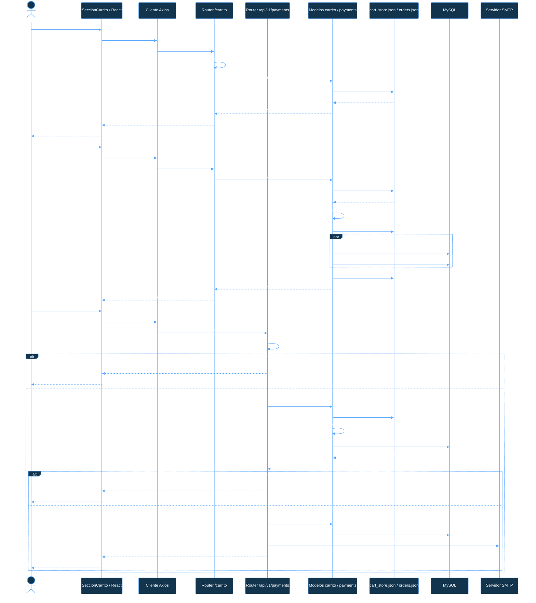
```mermaid
%%{init: {"theme":"base","themeVariables":{"background":"#0B1020","primaryColor":"#12344D","primaryTextColor":"#FFFFFF","primaryBorderColor":"#58A6FF","lineColor":"#58A6FF","textColor":"#FFFFFF","actorBkg":"#12344D","actorBorder":"#58A6FF","actorTextColor":"#FFFFFF","actorLineColor":"#58A6FF","signalColor":"#58A6FF","signalTextColor":"#FFFFFF","labelBoxBkgColor":"#12344D","labelBoxBorderColor":"#58A6FF","labelTextColor":"#FFFFFF","loopTextColor":"#FFFFFF","noteBkgColor":"#12344D","noteBorderColor":"#58A6FF","noteTextColor":"#FFFFFF","activationBkgColor":"#12344D","activationBorderColor":"#58A6FF","sequenceNumberColor":"#FFFFFF"}}}%%
sequenceDiagram
    actor Comprador
    participant UI as SecciónCarrito / React
    participant Axios as Cliente Axios
    participant CarritoAPI as Router /carrito
    participant PagoAPI as Router /api/v1/payments
    participant Modelo as Modelos carrito / payments
    participant JSON as cart_store.json / orders.json
    participant DB as MySQL
    participant SMTP as Servidor SMTP

    Comprador->>UI: Selecciona libro y cantidad
    UI->>Axios: POST /carrito
    Axios->>CarritoAPI: Bearer JWT + item
    CarritoAPI->>CarritoAPI: Valida token y normaliza cantidad
    CarritoAPI->>Modelo: agregar_al_carrito(id_usuario, item)
    Modelo->>JSON: Guarda item
    JSON-->>Modelo: Carrito actualizado
    Modelo-->>CarritoAPI: Resultado
    CarritoAPI-->>UI: Ítems del carrito
    UI-->>Comprador: Confirma agregado

    Comprador->>UI: Confirma compra y entrega
    UI->>Axios: POST /carrito/checkout
    Axios->>CarritoAPI: Dirección y tipo_entrega
    CarritoAPI->>Modelo: checkout_carrito(...)
    Modelo->>JSON: Lee carrito
    JSON-->>Modelo: Ítems
    Modelo->>Modelo: Calcula subtotal, envío y total
    Modelo->>JSON: Guarda orden
    opt Sincronización SQL secundaria
        Modelo->>DB: Inserta ordenes_compra
        Modelo->>DB: Inserta detalle_orden
    end
    Modelo->>JSON: Vacía carrito
    Modelo-->>CarritoAPI: Orden creada
    CarritoAPI-->>UI: Orden pendiente

    Comprador->>UI: Elige método de pago y confirma
    UI->>Axios: POST /api/v1/payments
    Axios->>PagoAPI: PagoRequest + token
    PagoAPI->>PagoAPI: Valida dirección para domicilio
    alt Dirección faltante para domicilio
        PagoAPI-->>UI: 400 Dirección requerida
        UI-->>Comprador: Solicita dirección
    else Dirección válida o retiro en tienda
        PagoAPI->>Modelo: registrar_pago(...)
        Modelo->>JSON: Obtiene orden
        Modelo->>Modelo: Valida monto y aplica cupón
        Modelo->>DB: Registra o consulta pago
        DB-->>Modelo: Estado del pago
        Modelo-->>PagoAPI: Resultado
        alt Pago no registrado
            PagoAPI-->>UI: 400 Pago rechazado
            UI-->>Comprador: Muestra motivo
        else Pago registrado
            PagoAPI->>Modelo: Registra ingreso del vendedor
            Modelo->>DB: Actualiza finanzas/estado
            PagoAPI->>SMTP: Envía confirmación si se solicita
            PagoAPI-->>UI: Pago confirmado
            UI-->>Comprador: Muestra comprobante y estado
        end
    end
```

**Nota técnica:** el JSON es el almacenamiento principal del flujo actual y MySQL recibe una sincronización secundaria. Un fallo SQL puede capturarse sin cancelar la orden creada en JSON.

## 6. Perfil e historial del usuario

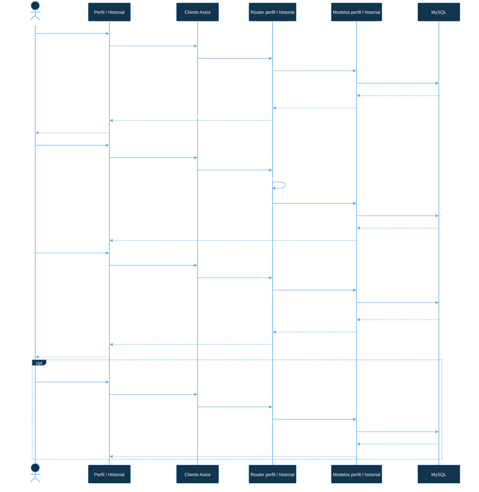
```mermaid
%%{init: {"theme":"base","themeVariables":{"background":"#0B1020","primaryColor":"#12344D","primaryTextColor":"#FFFFFF","primaryBorderColor":"#58A6FF","lineColor":"#58A6FF","textColor":"#FFFFFF","actorBkg":"#12344D","actorBorder":"#58A6FF","actorTextColor":"#FFFFFF","actorLineColor":"#58A6FF","signalColor":"#58A6FF","signalTextColor":"#FFFFFF","labelBoxBkgColor":"#12344D","labelBoxBorderColor":"#58A6FF","labelTextColor":"#FFFFFF","loopTextColor":"#FFFFFF","noteBkgColor":"#12344D","noteBorderColor":"#58A6FF","noteTextColor":"#FFFFFF","activationBkgColor":"#12344D","activationBorderColor":"#58A6FF","sequenceNumberColor":"#FFFFFF"}}}%%
sequenceDiagram
    actor Usuario
    participant UI as Perfil / Historial
    participant Axios as Cliente Axios
    participant API as Router perfil / historial
    participant Modelo as Modelos perfil / historial
    participant DB as MySQL

    Usuario->>UI: Abre perfil
    UI->>Axios: GET /perfil/mi-perfil
    Axios->>API: Bearer JWT
    API->>Modelo: Obtiene perfil
    Modelo->>DB: Usuario y datos asociados
    DB-->>Modelo: Perfil
    Modelo-->>API: Datos del perfil
    API-->>UI: Respuesta HTTP
    UI-->>Usuario: Muestra datos

    Usuario->>UI: Actualiza datos o preferencias
    UI->>Axios: PUT /perfil/actualizar
    Axios->>API: Cambios solicitados
    API->>API: Valida usuario autenticado y campos
    API->>Modelo: Actualiza perfil
    Modelo->>DB: UPDATE usuario/perfil
    DB-->>Modelo: Confirmación
    Modelo-->>UI: Perfil actualizado

    Usuario->>UI: Consulta historial
    UI->>Axios: GET /historial-interacciones
    Axios->>API: Filtro, límite y desplazamiento
    API->>Modelo: Obtener historial y estadísticas
    Modelo->>DB: Interacciones del usuario
    DB-->>Modelo: Visualizaciones, compras, reseñas,<br/>favoritos y otros eventos
    Modelo-->>API: Historial agregado
    API-->>UI: Listado y estadísticas
    UI-->>Usuario: Presenta filtros y resultados

    opt Eliminar interacción
        Usuario->>UI: Solicita eliminar
        UI->>Axios: DELETE /historial-interacciones/{id}
        Axios->>API: Id de interacción
        API->>Modelo: Elimina solo si pertenece al usuario
        Modelo->>DB: DELETE
        DB-->>Modelo: Confirmación
        Modelo-->>UI: Historial actualizado
    end
```

## 7. Publicación y gestión de libros por el vendedor

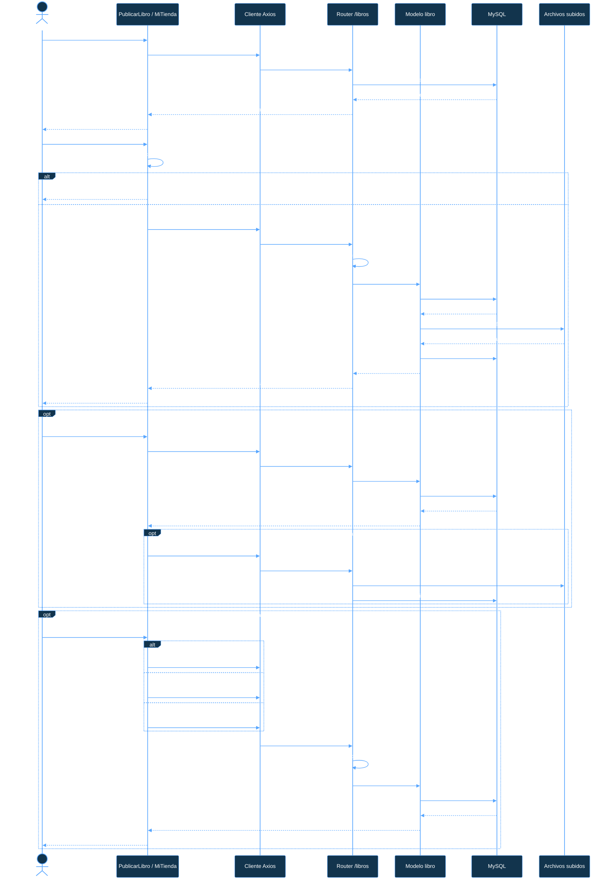
```mermaid
%%{init: {"theme":"base","themeVariables":{"background":"#0B1020","primaryColor":"#12344D","primaryTextColor":"#FFFFFF","primaryBorderColor":"#58A6FF","lineColor":"#58A6FF","textColor":"#FFFFFF","actorBkg":"#12344D","actorBorder":"#58A6FF","actorTextColor":"#FFFFFF","actorLineColor":"#58A6FF","signalColor":"#58A6FF","signalTextColor":"#FFFFFF","labelBoxBkgColor":"#12344D","labelBoxBorderColor":"#58A6FF","labelTextColor":"#FFFFFF","loopTextColor":"#FFFFFF","noteBkgColor":"#12344D","noteBorderColor":"#58A6FF","noteTextColor":"#FFFFFF","activationBkgColor":"#12344D","activationBorderColor":"#58A6FF","sequenceNumberColor":"#FFFFFF"}}}%%
sequenceDiagram
    actor Vendedor
    participant UI as PublicarLibro / MiTienda
    participant Axios as Cliente Axios
    participant API as Router /libros
    participant Modelo as Modelo libro
    participant DB as MySQL
    participant Uploads as Archivos subidos

    Vendedor->>UI: Abre formulario de publicación
    UI->>Axios: GET /libros/categorias
    Axios->>API: Solicita categorías
    API->>DB: Consulta categorías
    DB-->>API: Lista disponible
    API-->>UI: Categorías
    UI-->>Vendedor: Presenta formulario

    Vendedor->>UI: Completa datos, imágenes y variantes
    UI->>UI: Valida stock, precio, estado y fecha
    alt Validación incorrecta
        UI-->>Vendedor: Muestra error local
    else Datos válidos
        UI->>Axios: POST /libros/publicar multipart
        Axios->>API: Bearer JWT + datos e imágenes
        API->>API: Resuelve tienda activa del vendedor
        API->>Modelo: crear_libro(...)
        Modelo->>DB: INSERT libro
        DB-->>Modelo: id_libro
        Modelo->>Uploads: Guarda imágenes
        Uploads-->>Modelo: Rutas de archivos
        Modelo->>DB: INSERT imagenes_libro
        Modelo-->>API: id_libro y resultado
        API-->>UI: Libro publicado
        UI-->>Vendedor: Confirma publicación
    end

    opt Registrar variantes
        Vendedor->>UI: Agrega tapa, idioma, edición y stock
        UI->>Axios: POST /libros/{id}/variantes
        Axios->>API: Datos de variante
        API->>Modelo: Crear variante
        Modelo->>DB: INSERT libro_variantes
        DB-->>Modelo: id_variante
        Modelo-->>UI: Variante creada
        opt Variante digital
            UI->>Axios: POST /libros/{id}/variantes/{id}/archivo
            Axios->>API: Archivo digital
            API->>Uploads: Guarda archivo
            API->>DB: Asocia archivo a la variante
        end
    end

    opt Modificar stock o disponibilidad
        Vendedor->>UI: Cambia stock, oculta o elimina libro
        alt Cambiar stock
            UI->>Axios: PATCH /libros/{id}/stock
        else Ocultar libro
            UI->>Axios: PATCH /libros/{id}/ocultar
        else Eliminar libro
            UI->>Axios: DELETE /libros/{id}
        end
        Axios->>API: Operación autenticada
        API->>API: Verifica propiedad de la tienda
        API->>Modelo: Ejecuta operación
        Modelo->>DB: UPDATE o DELETE
        DB-->>Modelo: Confirmación
        Modelo-->>UI: Estado actualizado
        UI-->>Vendedor: Refresca catálogo de la tienda
    end
```

## 8. Ofertas y control de stock

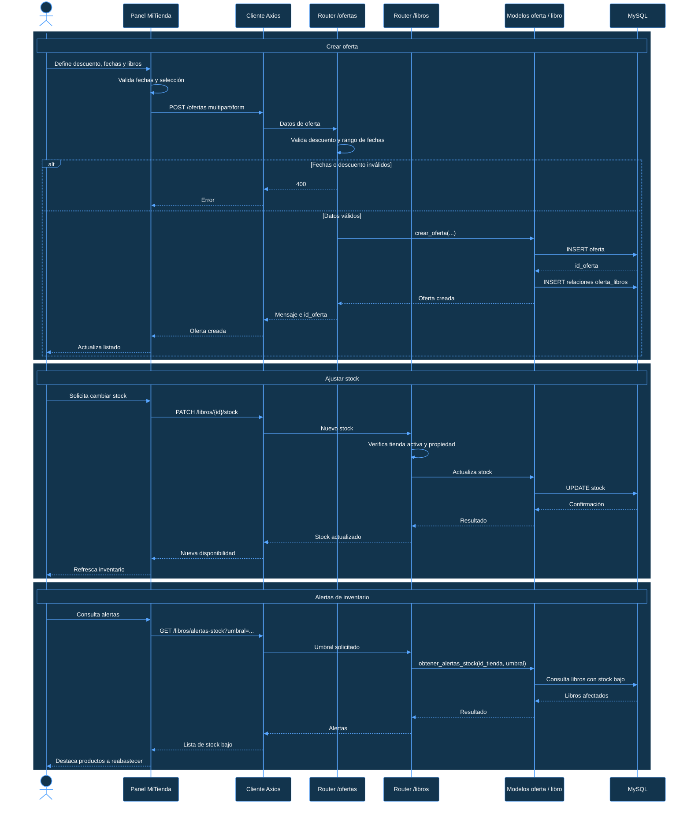
```mermaid
%%{init: {"theme":"base","themeVariables":{"background":"#0B1020","primaryColor":"#12344D","primaryTextColor":"#FFFFFF","primaryBorderColor":"#58A6FF","lineColor":"#58A6FF","textColor":"#FFFFFF","actorBkg":"#12344D","actorBorder":"#58A6FF","actorTextColor":"#FFFFFF","actorLineColor":"#58A6FF","signalColor":"#58A6FF","signalTextColor":"#FFFFFF","labelBoxBkgColor":"#12344D","labelBoxBorderColor":"#58A6FF","labelTextColor":"#FFFFFF","loopTextColor":"#FFFFFF","noteBkgColor":"#12344D","noteBorderColor":"#58A6FF","noteTextColor":"#FFFFFF","activationBkgColor":"#12344D","activationBorderColor":"#58A6FF","sequenceNumberColor":"#FFFFFF"}}}%%
sequenceDiagram
    actor Vendedor
    participant UI as Panel MiTienda
    participant Axios as Cliente Axios
    participant Ofertas as Router /ofertas
    participant Libros as Router /libros
    participant Modelo as Modelos oferta / libro
    participant DB as MySQL

    rect rgb(18, 52, 77)
    Note over Vendedor,DB: Crear oferta
    Vendedor->>UI: Define descuento, fechas y libros
    UI->>UI: Valida fechas y selección
    UI->>Axios: POST /ofertas multipart/form
    Axios->>Ofertas: Datos de oferta
    Ofertas->>Ofertas: Valida descuento y rango de fechas
    alt Fechas o descuento inválidos
        Ofertas-->>Axios: 400
        Axios-->>UI: Error
    else Datos válidos
        Ofertas->>Modelo: crear_oferta(...)
        Modelo->>DB: INSERT oferta
        DB-->>Modelo: id_oferta
        Modelo->>DB: INSERT relaciones oferta_libros
        Modelo-->>Ofertas: Oferta creada
        Ofertas-->>Axios: Mensaje e id_oferta
        Axios-->>UI: Oferta creada
        UI-->>Vendedor: Actualiza listado
    end
    end

    rect rgb(18, 52, 77)
    Note over Vendedor,DB: Ajustar stock
    Vendedor->>UI: Solicita cambiar stock
    UI->>Axios: PATCH /libros/{id}/stock
    Axios->>Libros: Nuevo stock
    Libros->>Libros: Verifica tienda activa y propiedad
    Libros->>Modelo: Actualiza stock
    Modelo->>DB: UPDATE stock
    DB-->>Modelo: Confirmación
    Modelo-->>Libros: Resultado
    Libros-->>Axios: Stock actualizado
    Axios-->>UI: Nueva disponibilidad
    UI-->>Vendedor: Refresca inventario
    end

    rect rgb(18, 52, 77)
    Note over Vendedor,DB: Alertas de inventario
    Vendedor->>UI: Consulta alertas
    UI->>Axios: GET /libros/alertas-stock?umbral=...
    Axios->>Libros: Umbral solicitado
    Libros->>Modelo: obtener_alertas_stock(id_tienda, umbral)
    Modelo->>DB: Consulta libros con stock bajo
    DB-->>Modelo: Libros afectados
    Modelo-->>Libros: Resultado
    Libros-->>Axios: Alertas
    Axios-->>UI: Lista de stock bajo
    UI-->>Vendedor: Destaca productos a reabastecer
    end
```

## 9. Favoritos, listas de deseos y reseñas

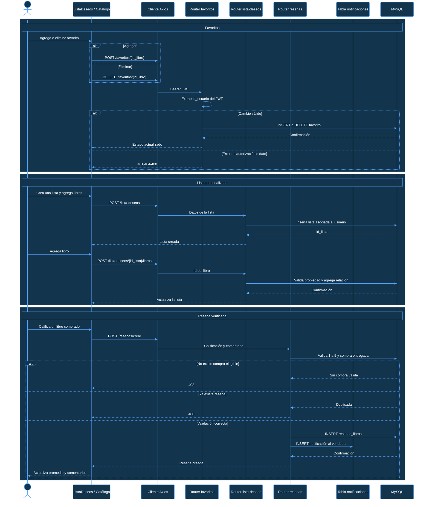
```mermaid
%%{init: {"theme":"base","themeVariables":{"background":"#0B1020","primaryColor":"#12344D","primaryTextColor":"#FFFFFF","primaryBorderColor":"#58A6FF","lineColor":"#58A6FF","textColor":"#FFFFFF","actorBkg":"#12344D","actorBorder":"#58A6FF","actorTextColor":"#FFFFFF","actorLineColor":"#58A6FF","signalColor":"#58A6FF","signalTextColor":"#FFFFFF","labelBoxBkgColor":"#12344D","labelBoxBorderColor":"#58A6FF","labelTextColor":"#FFFFFF","loopTextColor":"#FFFFFF","noteBkgColor":"#12344D","noteBorderColor":"#58A6FF","noteTextColor":"#FFFFFF","activationBkgColor":"#12344D","activationBorderColor":"#58A6FF","sequenceNumberColor":"#FFFFFF"}}}%%
sequenceDiagram
    actor Usuario
    participant UI as ListaDeseos / Catálogo
    participant Axios as Cliente Axios
    participant Favoritos as Router favoritos
    participant Deseos as Router lista-deseos
    participant Reseñas as Router resenas
    participant Notif as Tabla notificaciones
    participant DB as MySQL

    rect rgb(18, 52, 77)
    Note over Usuario,DB: Favoritos
    Usuario->>UI: Agrega o elimina favorito
    alt Agregar
        UI->>Axios: POST /favoritos/{id_libro}
    else Eliminar
        UI->>Axios: DELETE /favoritos/{id_libro}
    end
    Axios->>Favoritos: Bearer JWT
    Favoritos->>Favoritos: Extrae id_usuario del JWT
    alt Cambio válido
        Favoritos->>DB: INSERT o DELETE favorito
        DB-->>Favoritos: Confirmación
        Favoritos-->>UI: Estado actualizado
    else Error de autorización o dato
        Favoritos-->>UI: 401/404/400
    end
    end

    rect rgb(18, 52, 77)
    Note over Usuario,DB: Lista personalizada
    Usuario->>UI: Crea una lista y agrega libros
    UI->>Axios: POST /lista-deseos
    Axios->>Deseos: Datos de la lista
    Deseos->>DB: Inserta lista asociada al usuario
    DB-->>Deseos: id_lista
    Deseos-->>UI: Lista creada
    Usuario->>UI: Agrega libro
    UI->>Axios: POST /lista-deseos/{id_lista}/libros
    Axios->>Deseos: Id del libro
    Deseos->>DB: Valida propiedad y agrega relación
    DB-->>Deseos: Confirmación
    Deseos-->>UI: Actualiza la lista
    end

    rect rgb(18, 52, 77)
    Note over Usuario,DB: Reseña verificada
    Usuario->>UI: Califica un libro comprado
    UI->>Axios: POST /resenas/crear
    Axios->>Reseñas: Calificación y comentario
    Reseñas->>DB: Valida 1 a 5 y compra entregada
    alt No existe compra elegible
        DB-->>Reseñas: Sin compra válida
        Reseñas-->>UI: 403
    else Ya existe reseña
        DB-->>Reseñas: Duplicada
        Reseñas-->>UI: 400
    else Validación correcta
        Reseñas->>DB: INSERT resenas_libros
        Reseñas->>Notif: INSERT notificación al vendedor
        DB-->>Reseñas: Confirmación
        Reseñas-->>UI: Reseña creada
        UI-->>Usuario: Actualiza promedio y comentarios
    end
    end
```

## 10. Chat, notificaciones y soporte

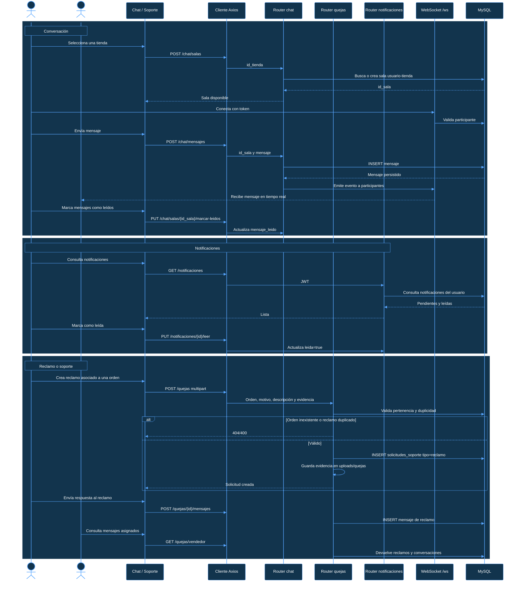
```mermaid
%%{init: {"theme":"base","themeVariables":{"background":"#0B1020","primaryColor":"#12344D","primaryTextColor":"#FFFFFF","primaryBorderColor":"#58A6FF","lineColor":"#58A6FF","textColor":"#FFFFFF","actorBkg":"#12344D","actorBorder":"#58A6FF","actorTextColor":"#FFFFFF","actorLineColor":"#58A6FF","signalColor":"#58A6FF","signalTextColor":"#FFFFFF","labelBoxBkgColor":"#12344D","labelBoxBorderColor":"#58A6FF","labelTextColor":"#FFFFFF","loopTextColor":"#FFFFFF","noteBkgColor":"#12344D","noteBorderColor":"#58A6FF","noteTextColor":"#FFFFFF","activationBkgColor":"#12344D","activationBorderColor":"#58A6FF","sequenceNumberColor":"#FFFFFF"}}}%%
sequenceDiagram
    actor Comprador
    actor Vendedor
    participant UI as Chat / Soporte
    participant Axios as Cliente Axios
    participant Chat as Router chat
    participant Quejas as Router quejas
    participant Notif as Router notificaciones
    participant WS as WebSocket /ws
    participant DB as MySQL

    rect rgb(18, 52, 77)
    Note over Comprador,Vendedor: Conversación
    Comprador->>UI: Selecciona una tienda
    UI->>Axios: POST /chat/salas
    Axios->>Chat: id_tienda
    Chat->>DB: Busca o crea sala usuario-tienda
    DB-->>Chat: id_sala
    Chat-->>UI: Sala disponible
    Comprador->>WS: Conecta con token
    WS->>DB: Valida participante
    Comprador->>UI: Envía mensaje
    UI->>Axios: POST /chat/mensajes
    Axios->>Chat: id_sala y mensaje
    Chat->>DB: INSERT mensaje
    DB-->>Chat: Mensaje persistido
    Chat->>WS: Emite evento a participantes
    WS-->>Vendedor: Recibe mensaje en tiempo real
    Comprador->>UI: Marca mensajes como leídos
    UI->>Axios: PUT /chat/salas/{id_sala}/marcar-leidos
    Axios->>Chat: Actualiza mensaje_leido
    end

    rect rgb(18, 52, 77)
    Note over Comprador,Notif: Notificaciones
    Comprador->>UI: Consulta notificaciones
    UI->>Axios: GET /notificaciones
    Axios->>Notif: JWT
    Notif->>DB: Consulta notificaciones del usuario
    DB-->>Notif: Pendientes y leídas
    Notif-->>UI: Lista
    Comprador->>UI: Marca como leída
    UI->>Axios: PUT /notificaciones/{id}/leer
    Axios->>Notif: Actualiza leida=true
    end

    rect rgb(18, 52, 77)
    Note over Comprador,Vendedor: Reclamo o soporte
    Comprador->>UI: Crea reclamo asociado a una orden
    UI->>Axios: POST /quejas multipart
    Axios->>Quejas: Orden, motivo, descripción y evidencia
    Quejas->>DB: Valida pertenencia y duplicidad
    alt Orden inexistente o reclamo duplicado
        Quejas-->>UI: 404/400
    else Válido
        Quejas->>DB: INSERT solicitudes_soporte tipo=reclamo
        Quejas->>Quejas: Guarda evidencia en uploads/quejas
        Quejas-->>UI: Solicitud creada
    end
    Comprador->>UI: Envía respuesta al reclamo
    UI->>Axios: POST /quejas/{id}/mensajes
    Quejas->>DB: INSERT mensaje de reclamo
    Vendedor->>UI: Consulta mensajes asignados
    UI->>Axios: GET /quejas/vendedor
    Quejas->>DB: Devuelve reclamos y conversaciones
    end
```

## 11. Administración, bloqueo y moderación

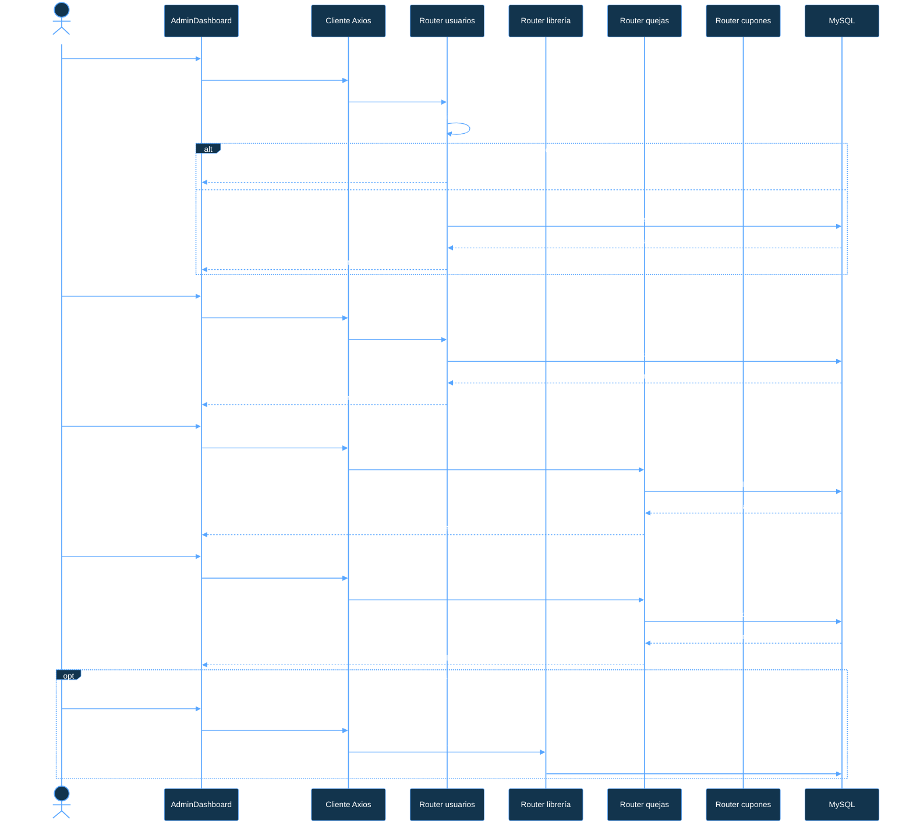
```mermaid
%%{init: {"theme":"base","themeVariables":{"background":"#0B1020","primaryColor":"#12344D","primaryTextColor":"#FFFFFF","primaryBorderColor":"#58A6FF","lineColor":"#58A6FF","textColor":"#FFFFFF","actorBkg":"#12344D","actorBorder":"#58A6FF","actorTextColor":"#FFFFFF","actorLineColor":"#58A6FF","signalColor":"#58A6FF","signalTextColor":"#FFFFFF","labelBoxBkgColor":"#12344D","labelBoxBorderColor":"#58A6FF","labelTextColor":"#FFFFFF","loopTextColor":"#FFFFFF","noteBkgColor":"#12344D","noteBorderColor":"#58A6FF","noteTextColor":"#FFFFFF","activationBkgColor":"#12344D","activationBorderColor":"#58A6FF","sequenceNumberColor":"#FFFFFF"}}}%%
sequenceDiagram
    actor Admin
    participant UI as AdminDashboard
    participant Axios as Cliente Axios
    participant Usuarios as Router usuarios
    participant Libreria as Router librería
    participant Quejas as Router quejas
    participant Cupones as Router cupones
    participant DB as MySQL

    Admin->>UI: Consulta usuarios
    UI->>Axios: GET /usuarios
    Axios->>Usuarios: Bearer JWT
    Usuarios->>Usuarios: require_role(admin, administrador)
    alt Rol insuficiente
        Usuarios-->>UI: 403
    else Rol válido
        Usuarios->>DB: Lista usuarios
        DB-->>Usuarios: Usuarios
        Usuarios-->>UI: Tabla administrativa
    end

    Admin->>UI: Bloquea o desbloquea usuario
    UI->>Axios: PATCH /usuarios/{id}/bloquear
    Axios->>Usuarios: Nuevo estado
    Usuarios->>DB: UPDATE estado_usuario
    DB-->>Usuarios: Confirmación
    Usuarios-->>UI: Estado actualizado

    Admin->>UI: Consulta reclamos pendientes
    UI->>Axios: GET /quejas/admin/todas
    Axios->>Quejas: JWT
    Quejas->>DB: Lista solicitudes
    DB-->>Quejas: Reclamos
    Quejas-->>UI: Dashboard de moderación

    Admin->>UI: Resuelve reclamo
    UI->>Axios: PATCH /quejas/admin/{id}
    Axios->>Quejas: Estado y respuesta
    Quejas->>DB: UPDATE solicitud, estado y fecha
    DB-->>Quejas: Confirmación
    Quejas-->>UI: Reclamo resuelto

    opt Modificar estado de tienda
        Admin->>UI: Aprueba, bloquea o reabre tienda
        UI->>Axios: PATCH /tiendas/{id_tienda}/estado
        Axios->>Libreria: Nuevo estado
        Libreria->>DB: UPDATE estado_tienda
    end
```

## 12. Envios, devoluciones y retiro en tienda

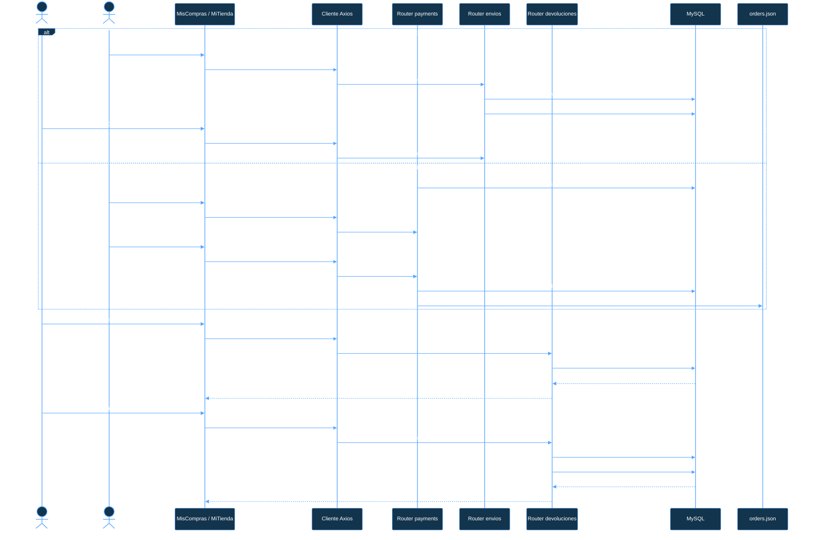
```mermaid
%%{init: {"theme":"base","themeVariables":{"background":"#0B1020","primaryColor":"#12344D","primaryTextColor":"#FFFFFF","primaryBorderColor":"#58A6FF","lineColor":"#58A6FF","textColor":"#FFFFFF","actorBkg":"#12344D","actorBorder":"#58A6FF","actorTextColor":"#FFFFFF","actorLineColor":"#58A6FF","signalColor":"#58A6FF","signalTextColor":"#FFFFFF","labelBoxBkgColor":"#12344D","labelBoxBorderColor":"#58A6FF","labelTextColor":"#FFFFFF","loopTextColor":"#FFFFFF","noteBkgColor":"#12344D","noteBorderColor":"#58A6FF","noteTextColor":"#FFFFFF","activationBkgColor":"#12344D","activationBorderColor":"#58A6FF","sequenceNumberColor":"#FFFFFF"}}}%%
sequenceDiagram
    actor Comprador
    actor Vendedor
    participant UI as MisCompras / MiTienda
    participant Axios as Cliente Axios
    participant Pagos as Router payments
    participant Envíos as Router envios
    participant Devoluciones as Router devoluciones
    participant DB as MySQL
    participant JSON as orders.json

    alt Entrega a domicilio
        Vendedor->>UI: Selecciona empresa y guía
        UI->>Axios: PUT /envios/orden/{id_orden}
        Axios->>Envíos: Comprador, empresa y número de guía
        Envíos->>DB: Valida vendedor y orden pagada
        Envíos->>DB: INSERT/UPDATE envios
        Comprador->>UI: Consulta guía
        UI->>Axios: GET /envios/orden/{id_orden}
        Axios->>Envíos: Devuelve rastreo y estado
    else Retiro en tienda
        Pagos->>DB: Genera reserva, PIN y fecha límite
        Vendedor->>UI: Confirma llegada del comprador
        UI->>Axios: POST /api/v1/orders/{id}/llegada-tienda
        Axios->>Pagos: Actualiza estado_retiro
        Vendedor->>UI: Habilita y confirma el pago/retiro
        UI->>Axios: POST /api/v1/orders/{id}/confirmar-entrega-retiro
        Axios->>Pagos: Confirma entrega y estado
        Pagos->>DB: Actualiza orden
        Pagos->>JSON: Sincroniza estado visible
    end

    Comprador->>UI: Consulta órdenes elegibles para devolución
    UI->>Axios: GET /devoluciones/elegibles
    Axios->>Devoluciones: JWT
    Devoluciones->>DB: Filtra órdenes entregadas/pagadas sin devolución activa
    DB-->>Devoluciones: Órdenes elegibles
    Devoluciones-->>UI: Opciones
    Comprador->>UI: Solicita devolución
    UI->>Axios: POST /devoluciones
    Axios->>Devoluciones: id_orden, motivo y comentarios
    Devoluciones->>DB: Valida orden y duplicidad
    Devoluciones->>DB: INSERT devolución estado=Solicitada
    DB-->>Devoluciones: Confirmación
    Devoluciones-->>UI: Solicitud registrada
```

## 13. Herramientas, impulsos, finanzas y suscripciones

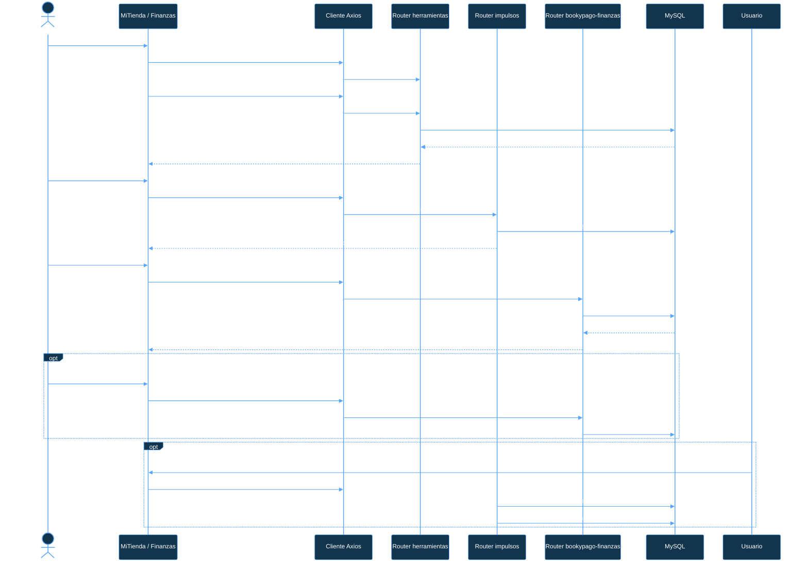
```mermaid
%%{init: {"theme":"base","themeVariables":{"background":"#0B1020","primaryColor":"#12344D","primaryTextColor":"#FFFFFF","primaryBorderColor":"#58A6FF","lineColor":"#58A6FF","textColor":"#FFFFFF","actorBkg":"#12344D","actorBorder":"#58A6FF","actorTextColor":"#FFFFFF","actorLineColor":"#58A6FF","signalColor":"#58A6FF","signalTextColor":"#FFFFFF","labelBoxBkgColor":"#12344D","labelBoxBorderColor":"#58A6FF","labelTextColor":"#FFFFFF","loopTextColor":"#FFFFFF","noteBkgColor":"#12344D","noteBorderColor":"#58A6FF","noteTextColor":"#FFFFFF","activationBkgColor":"#12344D","activationBorderColor":"#58A6FF","sequenceNumberColor":"#FFFFFF"}}}%%
sequenceDiagram
    actor Vendedor
    participant UI as MiTienda / Finanzas
    participant Axios as Cliente Axios
    participant Herr as Router herramientas
    participant Impulso as Router impulsos
    participant Finanzas as Router bookypago-finanzas
    participant DB as MySQL

    Vendedor->>UI: Consulta planes y suscripción
    UI->>Axios: GET /herramientas/planes
    Axios->>Herr: Lista planes
    UI->>Axios: GET /herramientas/mi-suscripcion
    Axios->>Herr: JWT
    Herr->>DB: Consulta suscripciones
    DB-->>Herr: Vigencia y plan
    Herr-->>UI: Estado disponible

    Vendedor->>UI: Contrata un impulso
    UI->>Axios: POST /impulsos/contratar
    Axios->>Impulso: Tipo, vigencia y coste
    Impulso->>DB: Valida disponibilidad y registra impulso
    Impulso-->>UI: Impulso contratado

    Vendedor->>UI: Consulta pagos pendientes
    UI->>Axios: GET /api/v1/bookypago-finanzas/pagos-pendientes/{id_vendedor}
    Axios->>Finanzas: Id del vendedor
    Finanzas->>DB: Calcula ingresos y cuentas
    DB-->>Finanzas: Saldos e historial
    Finanzas-->>UI: Panel financiero

    opt Cuenta bancaria
        Vendedor->>UI: Registra cuenta
        UI->>Axios: POST /api/v1/bookypago-finanzas/cuentas-bancarias/{id_vendedor}
        Axios->>Finanzas: Datos bancarios
        Finanzas->>DB: INSERT cuenta
    end

    opt Impulso visible
        Usuario->>UI: Consulta catálogo
        UI->>Axios: GET /impulsos/activos
        Impulso->>DB: Lista impresiones y clics vigentes
        Impulso->>DB: Registra impresión o clic
    end
```

## 14. Consumo móvil compartido

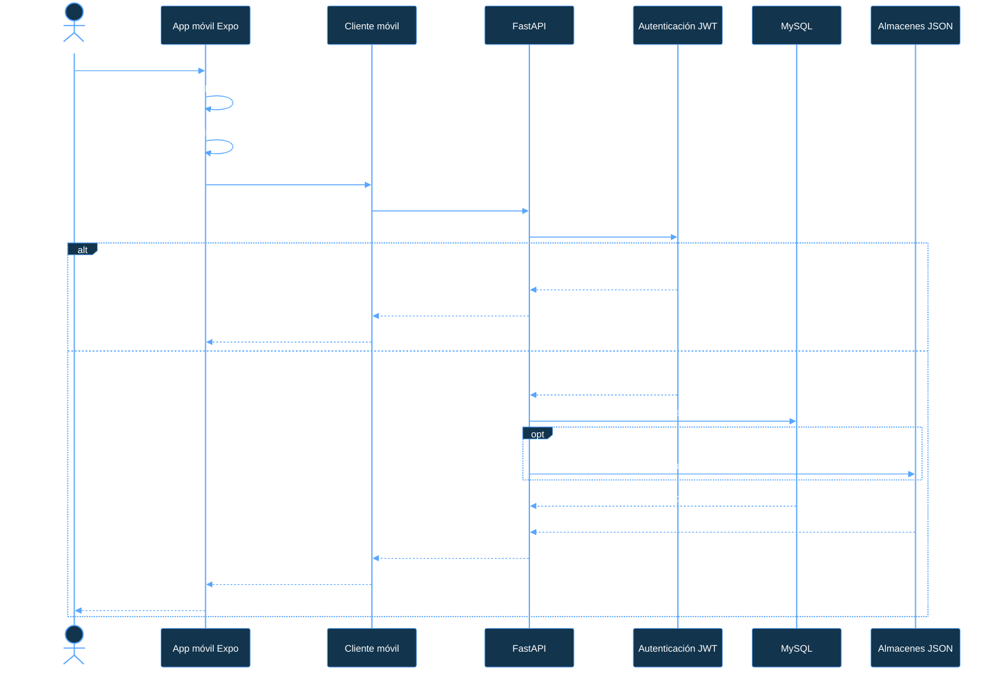
```mermaid
%%{init: {"theme":"base","themeVariables":{"background":"#0B1020","primaryColor":"#12344D","primaryTextColor":"#FFFFFF","primaryBorderColor":"#58A6FF","lineColor":"#58A6FF","textColor":"#FFFFFF","actorBkg":"#12344D","actorBorder":"#58A6FF","actorTextColor":"#FFFFFF","actorLineColor":"#58A6FF","signalColor":"#58A6FF","signalTextColor":"#FFFFFF","labelBoxBkgColor":"#12344D","labelBoxBorderColor":"#58A6FF","labelTextColor":"#FFFFFF","loopTextColor":"#FFFFFF","noteBkgColor":"#12344D","noteBorderColor":"#58A6FF","noteTextColor":"#FFFFFF","activationBkgColor":"#12344D","activationBorderColor":"#58A6FF","sequenceNumberColor":"#FFFFFF"}}}%%
sequenceDiagram
    actor Usuario
    participant App as App móvil Expo
    participant Axios as Cliente móvil
    participant API as FastAPI
    participant Auth as Autenticación JWT
    participant DB as MySQL
    participant JSON as Almacenes JSON

    Usuario->>App: Abre pantalla protegida
    App->>App: Lee EXPO_PUBLIC_API_URL
    App->>App: Lee token almacenado en el contexto móvil
    App->>Axios: Solicitud HTTP con Bearer JWT
    Axios->>API: Llama al mismo endpoint web
    API->>Auth: Verifica token, usuario y rol
    alt Token inválido o expirado
        Auth-->>API: Autenticación rechazada
        API-->>Axios: 401
        Axios-->>App: Solicita volver a iniciar sesión
    else Token válido
        Auth-->>API: sub y rol
        API->>DB: Ejecuta consulta o actualización
        opt Flujo de carrito u órdenes
            API->>JSON: Usa cart_store.json u orders.json
        end
        DB-->>API: Resultado
        JSON-->>API: Resultado
        API-->>Axios: Respuesta JSON
        Axios-->>App: Actualiza pantalla y contexto
        App-->>Usuario: Presenta resultado
    end
```

La app móvil no usa una API independiente ni una base de datos propia. Debe apuntar a la IP alcanzable del backend, mientras el despliegue web usa `VITE_API_BASE_URL`. Los flujos funcionales descritos en las secciones anteriores son compartidos por ambos clientes donde cada pantalla los consume.

## 15. Límites conocidos y decisiones documentales

| Hallazgo confirmado | Impacto en los diagramas | Estado |
|---|---|---|
| El carrito usa `cart_store.json` y las órdenes usan `orders.json` como persistencia principal | Checkout y consulta muestran una fuente JSON y una sincronización SQL secundaria | Documentado como dualidad |
| Al agregar el mismo libro no existe actualización independiente de cantidad en la API actual | El flujo actual suma la cantidad enviada al ítem existente | Cumple parcialmente RF-034 |
| El backend define `/ofertas`, pero RF-040 requiere mostrar la promoción activa en catálogo | El CRUD existe; la consulta activa existe, pero el catálogo no consume el descuento de forma visible | Parcial |
| La comparación lado a lado no tiene implementación | No se crea un diagrama de secuencia como funcionalidad existente | RF-033 pendiente |
| El logout no revoca JWT en servidor | El diagrama describe limpieza local y token con expiración | Limitación conocida |
| El calificador de tienda está implementado, pero su router no se incluye en `main.py` | Las rutas existen en el módulo pero no están registradas actualmente en FastAPI | Desactivado temporalmente |
| El frontend web y la app móvil usan el mismo backend, pero sus secuencias no deben intercambiar participantes como si fueran idénticos | Este documento representa el flujo web; el backend es compartido | Alcance explícito |
| Algunas respuestas y rutas del RF-001 usan una convención `/api/v1/auth/*` antigua | La implementación vigente usa `POST /register` y `GET /verify-email` | Prioridad a código vigente |

### Reglas de consistencia para futuras mejoras

1. Actualizar este documento cuando cambie una ruta registrada en `backend/app/main.py`.
2. Mantener separados los almacenes JSON y las tablas MySQL; no describirlos como una única base de datos.
3. Si se agrega un endpoint PATCH/PUT para cantidad del carrito, actualizar la sección 5.
4. Si Catalogo.jsx consume `/ofertas/libro/{id}/activa`, añadir el cálculo de precio promocional a la sección 8.
5. Si se activa `calificaciones_tiendas_router`, actualizar el diagrama de comunidad y el registro en `main.py`.
6. Si cambia el método de almacenamiento de órdenes, sustituir `JSON` por el nuevo componente persistente.
